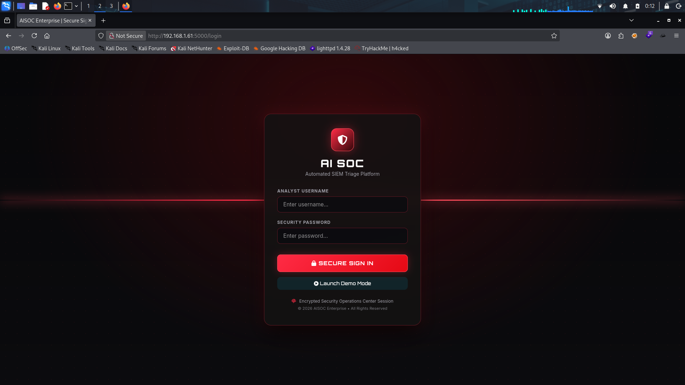
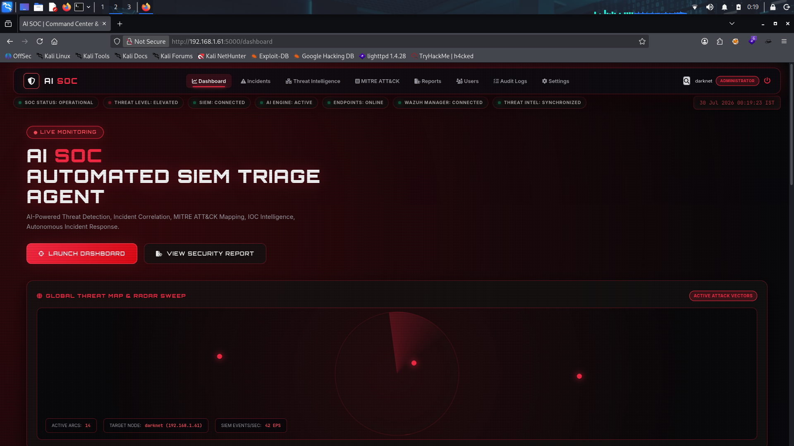
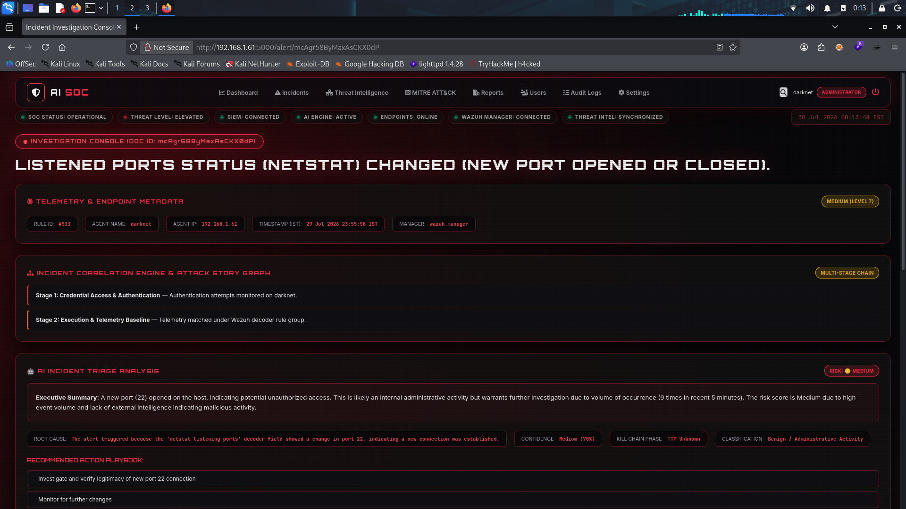
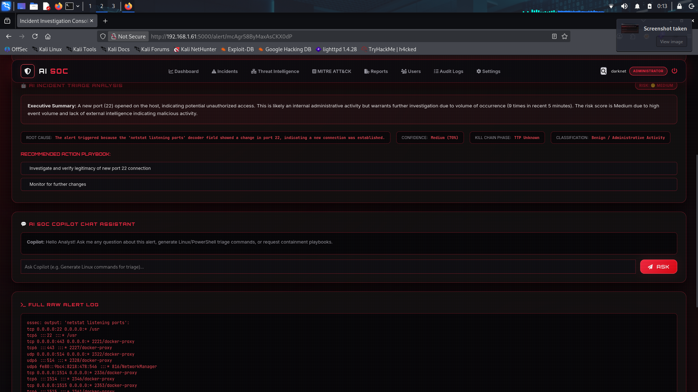
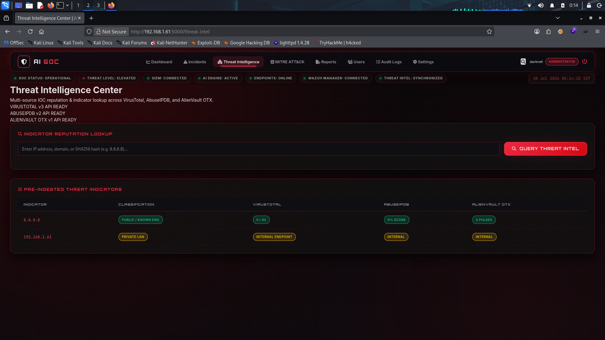
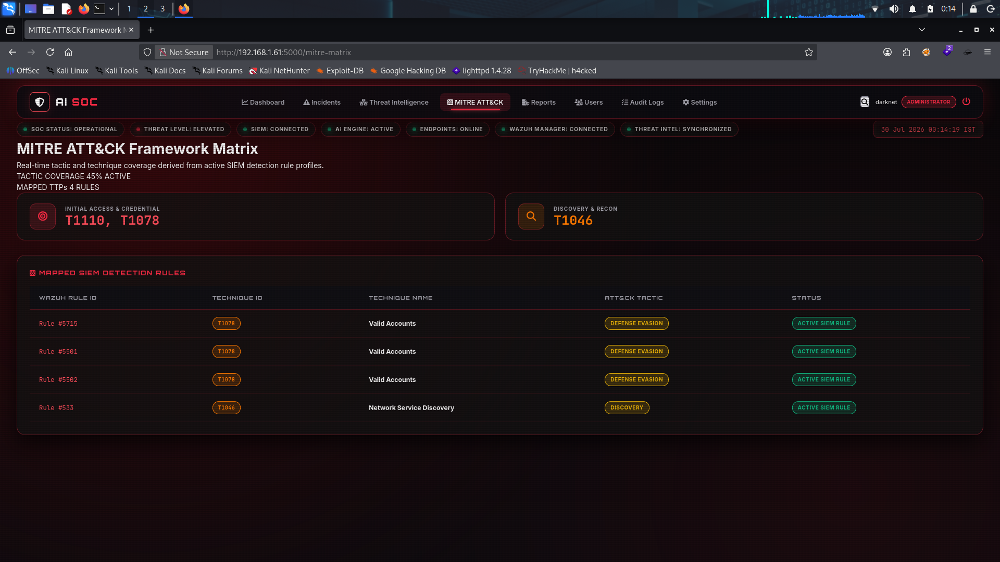
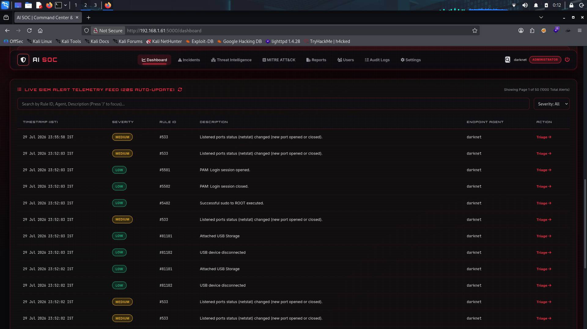
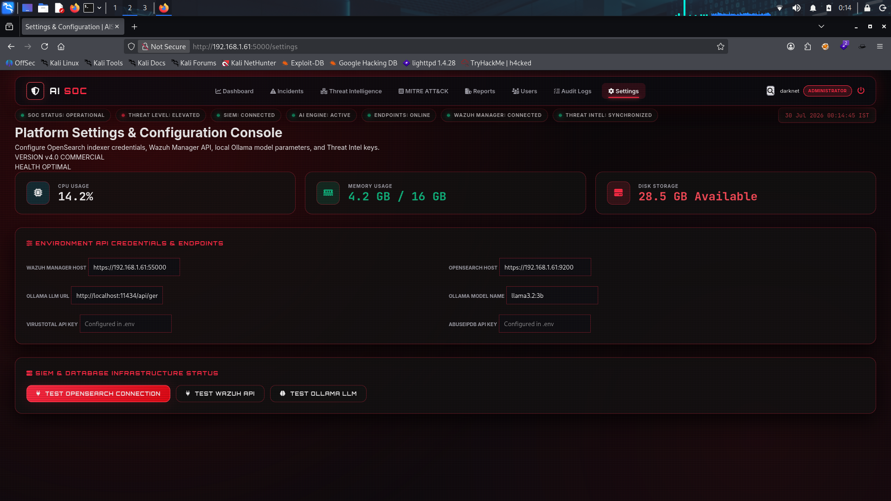
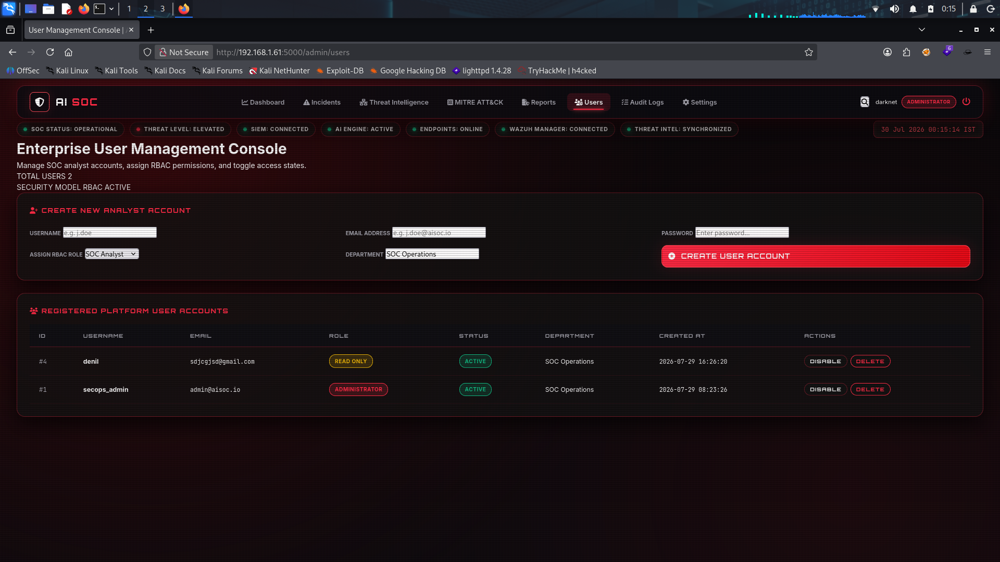

# AISOC Enterprise - Autonomous SIEM Triage Agent

[](https://github.com/)
[](https://github.com/)
[](LICENSE)

**AISOC Enterprise** is an enterprise-grade AI-powered Security Operations Center (SOC) platform designed for automated SIEM alert triage, incident correlation, MITRE ATT&CK mapping, threat intelligence enrichment, and ReportLab PDF report generation.

---

## ⚡ Key Platform Features

- **⚡ Instant Non-Blocking Dashboard (< 500ms)**: Decoupled telemetry rendering with zero LLM latency blocking on page loads.
- **🛠️ First-Run Setup Wizard (`/setup`)**: Interactive web setup wizard that configures administrator credentials, `.env` parameters, and database schemas automatically.
- **🛡️ Demo Mode (SIEM Fallback)**: Built-in rich telemetry fallback allowing recruiters and analysts to explore the platform without an active Wazuh SIEM deployment.
- **🤖 Evidence-First AI Reasoning Engine**: Powered by local Ollama (`llama3.2:3b`) with dedicated `InvestigationContextBuilder` telemetry collection.
- **📄 ReportLab PDF Export**: Commercial PDF incident investigation reports with corporate headers, metadata tables, MITRE mappings, and AI digital signatures.
- **💬 AI SOC Copilot Rule Generator**: Interactive chat assistant generating Sigma rules, YARA rules, Splunk SPL, Microsoft KQL, and Wazuh XML decoders/rules.
- **🔎 Global Platform Search (`/api/search`)**: Search across OpenSearch SIEM alerts, agent hosts, rule IDs, saved report archives, and IOC indicators.
- **🔐 SQLite RBAC Authentication**: Secure session management, werkzeug password hashing, and granular role authorization (`Administrator`, `SOC Manager`, `SOC Analyst`, `Read Only`, `Auditor`).

---

## 🚀 Quick Start Guide

### 1. Installation

```bash
git clone https://github.com/your-org/AI-SOC-Agent.git
cd AI-SOC-Agent
chmod +x install.sh
./install.sh
```

### 2. Launch Platform

```bash
./venv/bin/python web_app.py
```

Navigate to **`http://localhost:5000`** in your browser.

- **First Run**: Automatically redirects to `/setup` wizard to configure your admin account and SIEM URLs.
- **Demo Mode**: Click **"Launch Demo Mode"** on the login page for standalone demonstration.

---

## 📂 Project Architecture

```
AI-SOC-Agent/
├── ai/                      # AI LLM prompt builder & response parsers
├── auth/                    # RBAC models, SQLite auth, First-Run Setup Wizard
├── database/                # SQLite database schema initializer (aisoc.db)
├── dashboard/               # Dashboard routes, IST timezone utils, REST APIs
├── mitre/                   # MITRE ATT&CK TTP mapping engine
├── parser/                  # Alert normalizer & risk score calculator
├── reports/                 # Persistent report JSON cache & ReportLab PDF exports
├── services/                # Context Builder, Search, PDF Export, Demo Telemetry
├── threat_intel/            # VirusTotal, AbuseIPDB, AlienVault OTX clients
├── templates/               # Cyber Red HTML5 Jinja2 UI templates
├── static/                  # Cyber Red CSS stylesheets & JavaScript
├── web_app.py               # Flask application entry point
├── config.py                # Configuration loader via python-dotenv
├── install.sh               # One-click Linux installation script
├── docker-compose.yml       # Docker container orchestration
├── .env.example             # Environment configuration template
└── README.md                # Open-source platform documentation
```

---

## 📄 License

Distributed under the **MIT License**. See `LICENSE` for more information.


<h2 align="center">📸 Application Screenshots</h2>

<p align="center">
  
  
</p>

<p align="center">
  
  
</p>

<p align="center">
  
  
</p>

<p align="center">
  
  
</p>

<p align="center">
  
</p>
